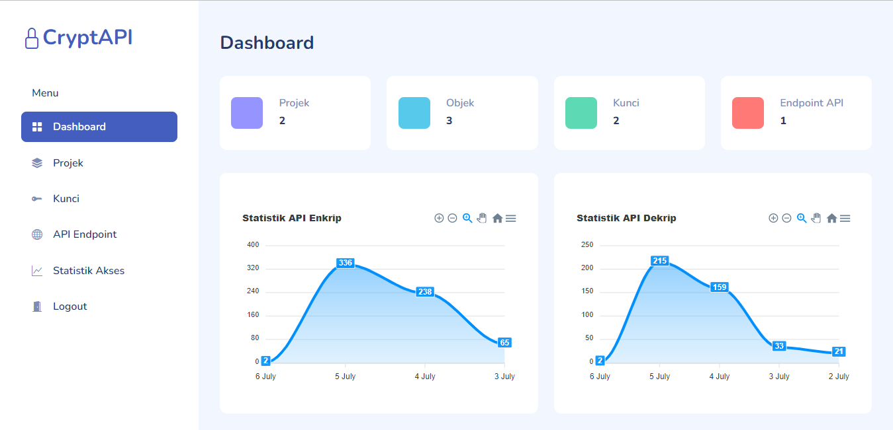

## Andreas Abi Permana
IT Freelancer, and FLOSS Enthusiast. I'm currently learning DevOps, and Cloud Computing.

## Kontak
* Alamat : Bekonang, Mojolaban, Sukoharjo, Jawa Tengah
* Email : me@abipermana.my.id
* Linkedin : [Andreas Abi Permana](https://id.linkedin.com/in/andreas-abi-permana-062776116)
* Facebook : [Andreas Abi Permana](https://www.facebook.com/andreas.abipermana)
* Telegram : [@AbiPermana](https://web.telegram.org/#/im?p=@AbiPermana)
* Twitter : [@abi_andreas](https://twitter.com/@abi_andreas)
* Github : [andreasabipermana](https://github.com/andreasabipermana)

## Portofolio Karya
### XServer

Merupakan script bash sederhana untuk  melakukan instalasi layanan infrastruktur web secara otomatis pada Server Debian 11.
  * Tautan : [https://github.com/andreasabipermana/XServer](https://github.com/andreasabipermana/XServer)
### Bangkit Capstone Project Nusademy Indonesia

Merupakan proyek akhir dari Bangkit Academy 2021, saya merancang arsitektur Cloud Computing menggunakan GCP dan mengimplementasikan arsitektur tersebut beserta pembuatan CI/CD pipeline pada aplikasi.
  * Tautan : [https://github.com/nusademy/Bangkit2021CapstoneProject](https://github.com/nusademy/Bangkit2021CapstoneProject) 
### Aplikasi CryptAPI menggunakan Codeigniter 3 dan MySQL

Merupakan aplikasi platform manajemen kunci kriptografi untuk mengamankan data sensitif pada aplikasi.
  * Tautan : [https://github.com/andreasabipermana/CryptAPI](https://github.com/andreasabipermana/CryptAPI) 
  * Live demo : https://cryptapi.abipermana.my.id
  * Login Administrator `admin` dan pass `123`
  * Login Pengguna `abi` dan pass `123`

### Aplikasi Penjualan berbasis Desktop PyQT
Merupakan aplikasi desktop penjualan toko sederhana dibangun menggunakan PyQT dan MySQL
  * Tautan : [https://github.com/andreasabipermana/aplikasi-penjualan-pyqt5-mysql](https://github.com/andreasabipermana/aplikasi-penjualan-pyqt5-mysql) 
