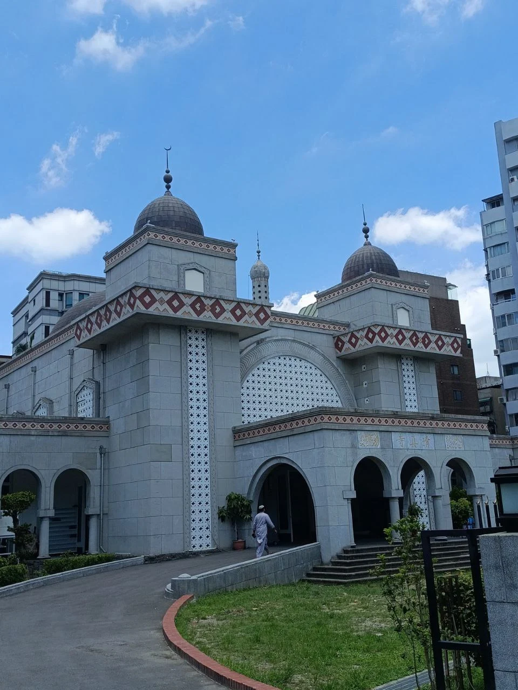

LibreOfiice Conference Asia 2024 merupakan momen besar dalam hidup saya, ini adalah pengalaman saya pergi keluar negeri, dan mengisi acara di konferensi untuk pertama kalinya. Disini saya akan membagikan sedikit pengalaman saya. 

## Cerita Awal
Semua bermula ketika, saya dan beberapa orang di undang Franklin Weng untuk menghadiri acara tersebut pada Mei, 2024. Saya memutuskan untuk ikut dalam acara tersebut.

Singkat cerita saya mempersiapkan semua hal sebelum keberangkatan, seperti paspor, visa, tiket menuju ke Bogor dan lain sebagainya.

## Berangkat
Pada 28 Juli saya berangkat ke Bogor dari Terminal Tirtonadi, Solo menuju ke Terminal Baranangsiang, Bogor. Rencananya saya akan singgah dulu di Kantor Nenggala sebelum berangkat bersama – sama ke Taipei. Pada 30 Juli malam, rombongan kami berangkat dari Stasiun Cilebut menuju ke Manggarai lalu naik ke Kereta bandara langsung menuju ke Soekarno-Hatta (CGK)

Setelah perjalanan pesawat yang cukup melelahkan kurang lebih 4-5jam akhirnya saya sampai di Bandara Internasional Hongkong untuk transit selama 3 jam, lalu terbang ke Bandara Taoyuan. Akhirnya setelah perjalanan kurang lebih 10 jam sampai di Taiwan.

Sorenya saya bertemu dengan teman lama yang bekerja di Taiwan untuk jalan jalan dan mencari makan malam :) . Kami pergi ke [Raohe Night Market](https://maps.app.goo.gl/2Rh6EA8v9VVD2zyUA) menggunakan sepeda motor. Suasana Raohe Night Market cukup sepi karena saat itu hujan baru saja reda di Taipei.

## Taipei Free Tour 

Pada hari berikutnya saya dan teman teman jalan jalan keliling Kota menaiki Taipei SightSeeing Bus.
Bus membawa kami berkeliling melewati beberapa lokasi wisata dan bersejarah di kota Taipei.

## Welcome Dinner Party

Singkat cerita, pada sorenya saya dan teman teman menghadari acara Welcome dinner party bersama pengurus dari The Document Foundation, penyelenggara acara, dan sponsor LibreOffice Conference Asia 2024.

Saya baru tau ternyata ada juga BRI cabang Taipei :v.

## Day 1: Government Day

Pada hari berikutnya rombongan kami dibagi menjadi 2, yang orang tua menghadiri Acara hari pertama Government Day, dan yang muda lanjut jalan jalan :).

Rombongan kami (anak – anak muda) berencana untuk mengunjungi beberapa tempat dan sekalian menuju ke Masjid untuk melaksanankan Sholat Jumat. Destinasi awal kami adalah [Blue Rider Art Gallery](https://maps.app.goo.gl/5593vspwMY98XPRx8). Galeri ini banyak menampilkan karya karya unik dan menarik.

Perjalanan selanjutnya kami menuju [Grand Mosque Taipei](https://maps.app.goo.gl/DtCdV1j9Ynght77z6), ternyata banyak orang orang indonesia yang solat jumat disana.

Setelah itu kami menuju ke [Fuzhou Shan Park](https://maps.app.goo.gl/BBMCrGectjKsXx6SA) untuk melihat view kota Taipei dari bukit. Meskipun cukup melelahkan untuk naik tangga untuk naik, akan tetapi semua terbayar setelah sampai disana :)

Setelah itu kami menyempatkan untuk mengunjungi salah satu toko mainan di pinggir jalan [Yifon Toys](https://maps.app.goo.gl/XYRbgh5v87ruqogf9). Saya sempat tertarik dengan salah satu Action Figure Digimon, akan tetapi setelah proses negoisasi cukup panjang saya gagal mendapatkannya :( (Maaf saya nggak sempet memfoto action figurenya wkwkw).

Sebelum kembali ke Hotel kami mengujungi [Taiwan Insect Museum](https://maps.app.goo.gl/kKmkjWBSDtVwN7Ex8) untuk melihat koleksi serangga dan hewan lain yang ada disana 

Malam harinya kami diajak jalan jalan penyelenggara acara untuk pergi ke [Raohe Night Market](https://maps.app.goo.gl/2Rh6EA8v9VVD2zyUA). Suasana night market kali ini sangat ramai.

