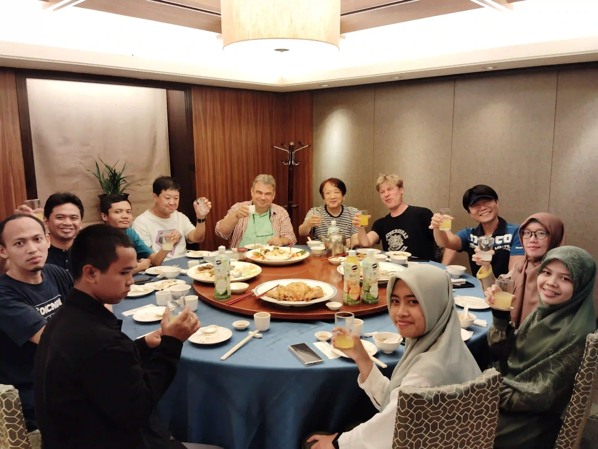

LibreOfiice Conference Asia 2024 merupakan momen besar dalam hidup saya, ini adalah pengalaman saya pergi keluar negeri, dan mengisi acara di konferensi untuk pertama kalinya. Disini saya akan membagikan sedikit pengalaman saya selama menghadiri acara tersebut. 

## Cerita Awal
Semua bermula pada bulan Mei 2024, saya dan beberapa orang di undang Franklin Weng dari [SLAT](https://slat.org/) selaku penyelenggara acara untuk menghadiri LibreOffice Conference Asia 2024 dan COSCUP 2024 yang akan diadakan di Taipei, Taiwan.  

Setelah itu saya mulai mempersiapkan semua hal sebelum berangkat ke taiwan, seperti uang saku, paspor, visa, tiket pesawat Jakarta Taipei PP, tiket menuju ke Bogor dan lain sebagainya.

Saya membuat Passpor di kantor Imigrasi Solo baru Sukoharjo dengan menggunakan pendaftaran online melalui M-Paspor. Beberapa hari sebelum hari kedatangan saya, PDN diserang oleh hacker sehingga data saya di aplikasi hilang, Untungnya file PDF bukti pendaftaran masih aman di laptop saya sehingga masih bisa melanjutkan proses pembuatan passpor, kalo file PDFnya hilang pasti harus buat lagi wkwkwkw. Alhamdulillah pembuatan passpor berjalan lancar dalam 4 hari kerja sudah bisa saya ambil.

Pembuatan VISA Taiwan saya lakukan dengan cara mandiri, yaitu dengan cara langsung datang ke kantor TETO Surabaya. VISA Taiwan membutuhkan persyaratan dokumen cukup banyak dan memakan waktu. Proses pembuatan VISA di TETO Surabaya memakan waktu selama 4 hari kerja. Setelah kurang lebih total 2 minggu untuk pembuatan VISA, Alhamdulillah pengajuan saya di setujui dan semua berjalan lancar tanpa kendala. Visa aman waktunya order tiket dan lain lain : ). 

## Berangkat
Pada 28 Juli saya berangkat ke Bogor dari Terminal Tirtonadi, Solo menuju ke Terminal Baranangsiang, Bogor. Rencananya saya akan singgah dulu di Bogor sebelum berangkat bersama – sama ke Taipei. Oiya, ini pengalaman pertama kalinya saya naik Bus Sleeper, dan ternyata sangat nyaman :).

Setelah sampai di Bogor pada pagi harinya, saya langsung menuju ke lokasi singgah untuk istirahat dan siap siap. Pada 30 Juli malam, rombongan kami berangkat dari Stasiun Cilebut menuju ke Manggarai, lalu naik ke Kereta bandara langsung menuju ke Soekarno-Hatta (CGK). Setelah proses pengecekkan dan lain lain, akhirnya kami berangkat dari Jakarta pada dini hari.

Setelah perjalanan pesawat yang cukup melelahkan kurang lebih 4-5 jam, kami sampai di Bandara Internasional Hongkong untuk transit selama 3 jam. Setelah itu kami terbang lagi ke Bandara Taoyuan, Taiwan. Akhirnya setelah perjalanan kurang lebih 2 jam dari Hongkong kami sampai di Taiwan. Sesaimpanya di Bandara Taouyuan kami disambut oleh Franklin Weng dan Eric Sun, lalu mengantarkan kami ke Hotel [Green World Hotel Grand Nanjing](https://maps.app.goo.gl/VkN2TD2vgZgkaNcQA) untuk beristirahat. Perjalanan dari Bandara ke Hotel kami tempuh menggunakan Airport Line menuju ke Taipei Main Station, dari sana kami berjalan kaki untuk menaiki MRT Beimen Station menuju ke Songjiang Nanjing Station, dan akhirnya sampai ke hotel :).

Sorenya saya bertemu dengan teman lama yang bekerja di Taiwan untuk jalan jalan dan mencari makan malam :). Kami pergi ke [Raohe Night Market](https://maps.app.goo.gl/2Rh6EA8v9VVD2zyUA) menggunakan sepeda motor. Ini pertama kali saya melihat suasana kota taipei di malam hari. Setelah bersepeda kurang lebih 15 menit akhirnya kami sampai di Raohe Night Market. Suasana Raohe Night Market cukup sepi karena saat itu hujan baru saja reda di Taipei. Disana kami jalan - jalan menyusuri pasar malam dari ujung hingga ujung. Oiya, makan malam saya membeli black tea dan nasi goreng daging sapi. 

Saya lupa foto makanannya :(

## Taipei Free Tour 

Pada hari berikutnya kami dibebaskan untuk jalan jalan di kota Taipei. Kami berencana jalan jalan keliling Kota menaiki dengan menaiki Taipei SightSeeing Double Decker Bus. Untuk menaiki bus tersebut kami menuju ke Beimen Station menggunakan MRT, dan jalan kaki untuk menuju ke Taipei Main Station. Sampai disana kami sempat kebingunggan untuk mencari pemberhentian dari bus. Setelah berkeliling dan bertanya ke petugas di stasiun, akhirnya kami menemukan tempat pemberhentian busnya.

Bus membawa kami berkeliling melewati beberapa lokasi wisata dan bersejarah di kota Taipei. Bus memiliki 2 rute yaitu Rute Merah dan Biru, karena kami membeli tiket 4 hour pass yang artinya bebas menaiki bus selama 4 jam, maka kami memanfaatkan tiket tersebut untuk menaiki kedua rute tersebut sekalian hehehe.

## Welcome Dinner Party

Pada sorenya saya dan teman teman menghadari acara Welcome dinner party bersama pengurus dari The Document Foundation, penyelenggara acara, dan sponsor LibreOffice Conference Asia 2024. Kami berjalan kaki dari hotel menuju salah satu restoran jepang di sana. Ditengah jalan kami melewati sebuah kantor bank yang tidak asing ternyata kantor bank BRI, saya baru tau ternyata ada juga BRI cabang Taipei :v.

Setelah sampai di restoran, acara welcome party dimulai dengan pembukaan dari Franklin Weng, dilanjut dengan perkenalan dari masing masing tamu dan dimulailah sesi makan - makan :) . Oiya di Taiwan alat makan utamanya adalah sumpit, dan saat itu saya belum bisa menggunakannya sampe kesusahan untuk mengambil makanan :( , untungnya dari restoran menyediakan sendok pada meja makan, akhirnya saya menggunakan sendok sambil dan belajar bagaimana menggunakan sumpit :) . Berikut beberapa foto saat Welcome party.

## Day 1: Government Day

Pada hari berikutnya rombongan kami dibagi menjadi 2, yang tua menghadiri Acara hari pertama Government Day, dan yang muda lanjut jalan jalan :).

Rombongan kami (anak – anak muda) berencana untuk mengunjungi beberapa tempat dan sekalian menuju ke Masjid untuk melaksanankan Sholat Jumat. Destinasi awal kami adalah [Blue Rider Art Gallery](https://maps.app.goo.gl/5593vspwMY98XPRx8). Untuk menuju ke destinasi pertama, kami naik MRT dari Songjiang Nanjing Station menuju ke Nanjing Fuxing Station untuk berpindah dari Green Line ke Brown Line, setelah sampai di Zhongxiao Fuxing kami turun dan jalan kaki menuju ke Blue Rider Art Gallery.

Blue Rider Art Gallery ini berada di lantai 5 pada sebuah gedung besar, dan ternyata untuk akses masuk ke galeri ini gratis. Disini saya melihat banyak karya-karya yang unik dan menarik. Kami disini kurang lebih selama 20 menit, lalu melanjutkan perjalanan untuk ke masjid.

Perjalanan selanjutnya kami menuju [Grand Mosque Taipei](https://maps.app.goo.gl/DtCdV1j9Ynght77z6), Karena kebingungan untuk mencari arah akhirnya kami bertanya ke salah satu polisi di jalan untuk menunjukkan arah. Polisi menganjurkan untuk menaiki bis menuju ke masjid melalui Halte yang ada disebelah jalan. Kami mengikuti saran dari polisi tersebut.

Singkat cerita akhirnya kami sampai di Masjid setelah berjalan kaki dari halte bus, sesampainya di masjid ternyata ada toko indonesia di sebelahnya. Karena waktu solat masih cukup lama dan cuaca di Taipei yang cukup panas, akhirnya saya menyempatkan untuk membeli beberapa gorengan dan Es Dawet disana hehehe. Setelah sampai waktu solat, kami masuk masjid dan melaksanankan solat jumat. Grand Mosque Taipei ini cukup besar, megah, ramai dan banyak orang orang indonesia yang solat jumat disana.

Setelah itu kami menuju ke [Fuzhou Shan Park](https://maps.app.goo.gl/BBMCrGectjKsXx6SA) untuk melihat view kota Taipei dari bukit.
Untuk kesana kami mencoba menaiki bus kembali bedanya disini informasi dari internet bebas biaya apabila menuju ke Fuzhou Shan Park. Setelah menunggu cukup lama di halte bus, akhirnya kami dapat menaiki bus tersebut menuju ke Fuzhou Shan Park dan benar-benar gratis :).

Akhirnya kami sampai di Fuzhou Shan Park, untuk sampai ke bukit kami harus menaiki cukup banyak anak tangga. Meskipun cukup melelahkan untuk naik tangga keatas, akan tetapi semua terbayar setelah sampai disana :) . Setelah cukup lama di atas bukit sambil berfoto-foto dan istirakat, kami melanjutkan perjalanan ke stasiun terdekat untuk kembali ke hotel.

Di tengah - tengah perjalanan kami menyempatkan untuk mengunjungi salah satu toko mainan di pinggir jalan [Yifon Toys](https://maps.app.goo.gl/XYRbgh5v87ruqogf9). Saya sempat tertarik dengan salah satu Action Figure Digimon, akan tetapi setelah proses tawar menawar cukup panjang saya gagal mendapatkannya :( . Setelah itu kami kembali meneruskan perjalanan.

Saya lupa foto action figure digimonnya :( :(

Di tengah - tengah perjalanan kami melewati [Taiwan Insect Museum](https://maps.app.goo.gl/kKmkjWBSDtVwN7Ex8). Karena kami kira waktunya masih cukup, akhirnya kami memutuskan untuk mengunjungi museum tersebut sebentar untuk melihat koleksi yang ada disana. Museum ini menampilkan banyak serangga, seperti berbagai jenis kumbang, kupu-kupu, belalang dan lain lain. Di museum ini tidak hanya ada serangga saja, akan tetapi juga ada hewan-hewan lainnya, seperti berbagai jenis reptil, kura-kura dan burung. Setelah keluar dari museum, kami menuju ke Linguang untuk kembali ke Hotel. 

Malam harinya kami diajak jalan jalan penyelenggara acara untuk pergi ke [Raohe Night Market](https://maps.app.goo.gl/2Rh6EA8v9VVD2zyUA). Kali ini saya menuju Raohe Night Market menggunakan MRT ke Stasiun Songshan. Suasana night market kali ini sangat ramai banyak pengujungnya. Pertama - tama kami mengunjungi sebuah Temple cukup besar di depan gerbang masuk utama, selanjutnya kami masuk ke pasar malam untuk jalan - jalan dan mencari makan malam. Setelah jam 8:30 kami berkumpul lagi di depan pintu masuk untuk kembali ke hotel.

Setelah itu kamu pulang ke Hotel menggunakan MRT dari Songshan menuju ke Songjiang Nanjing Station. Perjalanan hari ini cukup melelahkan, saya sampai hotel langsung istirahat mengingat besok masih ada acara utama yaitu Community Day dan COSCUP 2024 di [National Taiwan University of Science and Technology](https://maps.app.goo.gl/oF1tC1EqwDimFKFe6).

## Lanjut Part 2

Sampai disini dulu ceritanya ya, lanjut di [part 2](https://abipermana.my.id/posts/cerita-libreoffice-conference-asia-2024-taipei-part-2) :)

