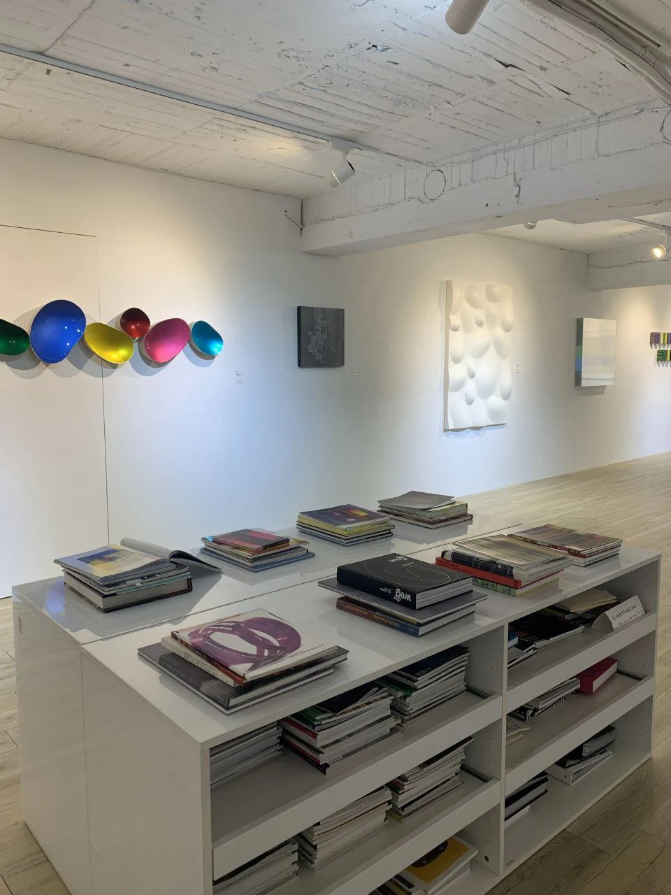

LibreOfiice Conference Asia 2024 merupakan momen besar dalam hidup saya, ini adalah pengalaman saya pergi keluar negeri, dan mengisi acara di konferensi untuk pertama kalinya. Disini saya akan membagikan sedikit pengalaman saya selama menghadiri acara tersebut. 

## Cerita Awal
Semua bermula pada bulan Mei 2024, saya dan beberapa orang di undang Franklin Weng dari [SLAT](https://slat.org/) selaku penyelenggara untuk menghadiri acara LibreOffice Conference Asia 2024 dan COSCUP 2024 yang akan diadakan di Taipei, Taiwan. Saya memutuskan untuk ikut dalam acara tersebut.

Singkat cerita saya dan teman teman lainnya mulai mempersiapkan semua hal sebelum keberangkatan, seperti uang saku, paspor, visa, tiket pesawat Jakarta Taipei PP, tiket menuju ke Bogor dan lain sebagainya.

Saya membuat Passpor di kantor Imigrasi Solo baru Sukoharjo dengan menggunakan pendaftaran online melalui M-Paspor. Beberapa hari sebelum hari kedatangan saya, PDN diserang oleh hacker sehingga data saya di aplikasi hilang, Untungnya file PDF bukti pendaftaran masih aman di laptop saya sehingga masih bisa melanjutkan proses pembuatan passpor, kalo file PDFnya hilang pasti harus buat lagi wkwkwkw. Alhamdulillah pembuatan passpor berjalan lancar dalam 4 hari kerja sudah bisa saya ambil.

Pembuatan VISA Taiwan saya lakukan dengan cara mandiri, yaitu dengan cara langsung datang ke kantor TETO Surabaya. VISA Taiwan membutuhkan persyaratan dokumen cukup banyak dan memakan waktu. Proses pembuatan VISA di TETO Surabaya memakan waktu selama 4 hari kerja. Setelah kurang lebih total 2 minggu untuk pembuatan VISA, Alhamdulillah pengajuan saya di setujui dan semua berjalan lancar tanpa kendala. Visa aman waktunya order tiket dan lain lain : ). 

## Berangkat
Pada 28 Juli saya berangkat ke Bogor dari Terminal Tirtonadi, Solo menuju ke Terminal Baranangsiang, Bogor. Rencananya saya akan singgah dulu di Bogor sebelum berangkat bersama – sama ke Taipei. 

Pada 30 Juli malam, rombongan kami berangkat dari Stasiun Cilebut menuju ke Manggarai lalu naik ke Kereta bandara langsung menuju ke Soekarno-Hatta (CGK)

Setelah perjalanan pesawat yang cukup melelahkan kurang lebih 4-5 jam akhirnya saya sampai di Bandara Internasional Hongkong untuk transit selama 3 jam, lalu terbang ke Bandara Taoyuan. Akhirnya setelah perjalanan kurang lebih 10 jam sampai di Taiwan.

Sorenya saya bertemu dengan teman lama yang bekerja di Taiwan untuk jalan jalan dan mencari makan malam :) . Kami pergi ke [Raohe Night Market](https://maps.app.goo.gl/2Rh6EA8v9VVD2zyUA) menggunakan sepeda motor. Suasana Raohe Night Market cukup sepi karena saat itu hujan baru saja reda di Taipei.

## Taipei Free Tour 

Pada hari berikutnya saya dan teman teman jalan jalan keliling Kota menaiki Taipei SightSeeing Double Decker Bus. Bus membawa kami berkeliling melewati beberapa lokasi wisata dan bersejarah di kota Taipei.

## Welcome Dinner Party

Pada sorenya saya dan teman teman menghadari acara Welcome dinner party bersama pengurus dari The Document Foundation, penyelenggara acara, dan sponsor LibreOffice Conference Asia 2024. Kami berjalan kaki dari hotel menuju salah satu restoran jepang di sana. Ditengah jalan kami melewati sebuah kantor bank yang tidak asing ternyata kantor bank BRI, saya baru tau ternyata ada juga BRI cabang Taipei :v.

Setelah sampai di restoran, acara welcome party dimulai dengan pembukaan dari Franklin Weng, dilanjut dengan perkenalan dari masing masing tamu dan dimulailah sesi makan - makan :) . Oiya di Taiwan alat makan utamanya adalah sumpit, dan saat itu saya belum bisa mengguanakannya sampe kesusahan untuk mengambil makanan :( , untungnya dari restoran menyediakan sendok pada meja makan, akhirnya saya menggunakan sendok sambil dan belajar bagaimana menggunakan sumpit :) . Berikut beberapa foto saat Welcome party.

## Day 1: Government Day

Pada hari berikutnya rombongan kami dibagi menjadi 2, yang tua menghadiri Acara hari pertama Government Day, dan yang muda lanjut jalan jalan :).

Rombongan kami (anak – anak muda) berencana untuk mengunjungi beberapa tempat dan sekalian menuju ke Masjid untuk melaksanankan Sholat Jumat. Destinasi awal kami adalah [Blue Rider Art Gallery](https://maps.app.goo.gl/5593vspwMY98XPRx8). Galeri ini banyak menampilkan karya karya unik dan menarik.

Perjalanan selanjutnya kami menuju [Grand Mosque Taipei](https://maps.app.goo.gl/DtCdV1j9Ynght77z6), Masjidnya cukup besar, megah, ramai dan ternyata banyak orang orang indonesia yang solat jumat disana.

Setelah itu kami menuju ke [Fuzhou Shan Park](https://maps.app.goo.gl/BBMCrGectjKsXx6SA) untuk melihat view kota Taipei dari bukit. Meskipun cukup melelahkan untuk naik tangga keatas, akan tetapi semua terbayar setelah sampai disana :)

Setelah itu kami menyempatkan untuk mengunjungi salah satu toko mainan di pinggir jalan [Yifon Toys](https://maps.app.goo.gl/XYRbgh5v87ruqogf9). Saya sempat tertarik dengan salah satu Action Figure Digimon, akan tetapi setelah proses tawar menawar cukup panjang saya gagal mendapatkannya :( . Oiya, maaf saya nggak sempat memfoto action figurenya wkwkw ).

Sebelum kembali ke Hotel kami mengujungi [Taiwan Insect Museum](https://maps.app.goo.gl/kKmkjWBSDtVwN7Ex8) untuk melihat koleksi yang ada disana. Museum ini tidak hanya memiliki serangga saja, akan tetapi juga ada hewan hewan lainnya, seperti berbagai jenis reptil. 

Malam harinya kami diajak jalan jalan penyelenggara acara untuk pergi ke [Raohe Night Market](https://maps.app.goo.gl/2Rh6EA8v9VVD2zyUA). Suasana night market kali ini sangat ramai.

## Lanjut Part 2

Sampai disini dulu ceritanya ya, lanjut di part 2 :)

