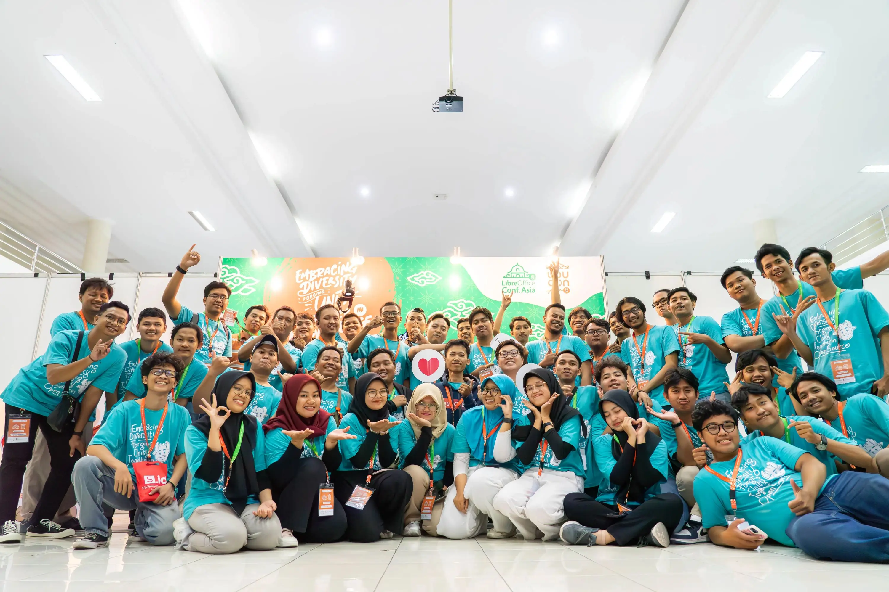

Halo, Perkenalkan saya Abi Permana, saya salah satu pengurus dari Komunitas Paguyuban Linux Solo. Pada tulisan ini saya akan menceritakan beberapa pengalaman saya sebagai panitia acara LOUCA2023. LOUCA2023 singkatan dari LibreOffice Conf. Asia x UbuCon Asia 2023 diselenggarakan secara kolaboratif oleh Komunitas LibreOffice Indonesia (LiberOffice ID), Ubuntu Indonesia (Ubuntu ID), Paguyuban Linux Solo, dan bekerja sama dengan Universitas Sebelas Maret sebagai penyedia tempat acara.

## Perjalanan Awal
Perjalanan saya sebagai panitia lokal dimulai ketika saya pertama kali diundang Rania Amina untuk pertemuan daring bersama pengurus LibreOffice Indonesia dan Ubuntu Indonesia. Dalam pertemuan tersebut disampaikan bahwa akan ada acara gabungan dari LibreOffice Conf. Asia dan UbuCon Asia di Indonesia, disampaikan juga bahwa Kota Surakarta menjadi salah satu kandidat kuat untuk menyelenggarakan acara tersebut. Saya dan teman - teman komunitas Paguyuban Linux Solo merasa tertantang dan bersemangat agar acara tersebut dapat terselenggara di Kota Surakarta. Saya pada waktu itu sebagai ketua komunitas Paguyuban Linux Solo ditunjuk sebagai Koordinator Panitia Lokal. Singkat cerita, kami berhasil bekerja sama dengan Universitas Sebelas Maret untuk menyelenggarakan acara LibreOffice Conf. Asia dan UbuCon Asia di Kota Surakarta.

Saat itu belum ada istilah LOUCA2023, baru setelah beberapa kali rapat dengan panitia pusat yang terdiri dari pengurus LibreOffice Indonesia dan Ubuntu Indonesia istilah LOUCA2023 kita sepakati.

## Tantangan

Selama mempersiapkan LOUCA2023, saya menghadapi banyak tantangan, termasuk masalah logistik, perizinan, dan koordinasi dengan dengan pihat terkait. Namun dengan adanya tantangan - tantangan tersebut membuat saya dan teman teman komunitas tetap solid dan saling membantu satu sama lain agar acara terlaksanana dengan baik. Bagi saya, tantangan - tantangan tersebut menjadi kesempatan yang berharga untuk tumbuh berkembang dan berkolaborasi.

Salah satu tantangan terbesar saya dalam acara ini adalah sulitnya koordinasi dengan Himpunan Mahasiswa dan Kampus. Selain itu, saya dan teman - teman juga menghadapi kendala terkait banyaknya tugas yang harus selesai sebelum hari-H acara dan beberapa masalah yang muncul di lapangan ketika pelaksanaan acara LOUCA2023. Namun, semua kesulitan ini dapat segera diatasi dengan dukungan teman-teman panitia dan volunteer yang saling membantu satu sama lain.


"Tidak ada acara tanpa kendala" ~ kata-kata dari teman dan mentor saya yang dulu pernah menyelenggarakan Event di Kota Solo.


## Kolaborasi dan Komunitas

Kunci kesuksesan LOUCA 2023 adalah adanya kolaborasi erat dengan komunitas LibreOffice Indonesia, Ubuntu Indonesia, dan Paguyuban Linux Solo. Kami bekerja sama untuk menyusun acara dan topik yang menarik, mengundang pembicara terkenal, dan menyediakan peluang bagi para peserta untuk terlibat aktif dalam acara. Kami juga mendapat dukungan luar biasa dari komunitas linux lokal lainnya yang bersedia memberikan waktu dan tenaga untuk memastikan kesuksesan acara ini. Kolaborasi dengan mereka adalah salah satu aspek terbaik dari pengalaman saya ini.

## Highlights Acara
Acara Utama LOUCA2023 yaoti terdiri dari 2 Hari pada hari sabtu - minggu tanggal 7-8 Oktober 2023 dan ada acara tambahan di hari senin tanggal 9 Oktober 2023 yaitu One Day Tour keliling Kota Surakarta untuk Panitia dan Pembicara. Berikut ini beberapa foto saat acara LOUCA2023 berlangsung

Pada hari sabtu - minggu tanggal 7-8 Oktober 2023 Malam ada Dinner untuk Panitia dan Pembicara. Berikut ini beberapa foto saat dinner.

Berikut ini beberapa foto saat One Day Tour Keliling Kota Surakarta.

Alhamdulillah acara LOUCA2023 secara keseluruhan berjalan dengan baik, lancar, dan sukses. Materi-materi yang disampaikan oleh para pembicara benar-benar menginspirasi.

## Pelajaran yang Didapat
Dari pengalaman ini, saya belajar bahwa kerja sama tim dan komunikasi adalah kunci keberhasilan dalam menyelenggarakan acara besar semacam LOUCA. Saya juga menyadari pentingnya mengatasi rintangan dengan tekad dan semangat yang tinggi.

## Kesimpulan
Menjadi koordinator panitia lokal LOUCA2023 menjadi salah satu pengalaman yang paling berharga dalam hidup saya. Saya berharap bahwa acara ini akan menginspirasi lebih banyak orang untuk berkontribusi dalam komunitas open source. 

## Penutup
Saya ucapkan terima kasih sebesar besarnya kepada seluruh teman teman panitia yang telah banyak membantu, kepada beberapa teman saya yang banyak memberikan saran dan inspirasi terkait persiapan dan pelaksanaan acara secara pribadi, dan tidak lupa saya ucapkan terima kasih juga untuk Kelompok Linux Arek Suroboyo (KLAS), dan UKM Linux Nurul Fikri yang banyak membantu selama acara.

Saya mohon maaf apabila ada kata-kata yang kurang berkenan dengan tulisan saya.

## Sumber
* Website LOUCA2023 [https://louca.id](https://louca.id)
* Foto Komunitas Acara LOUCA2023 [tautan](https://photos.app.goo.gl/ctS9jJQRmyaEyiS36)

