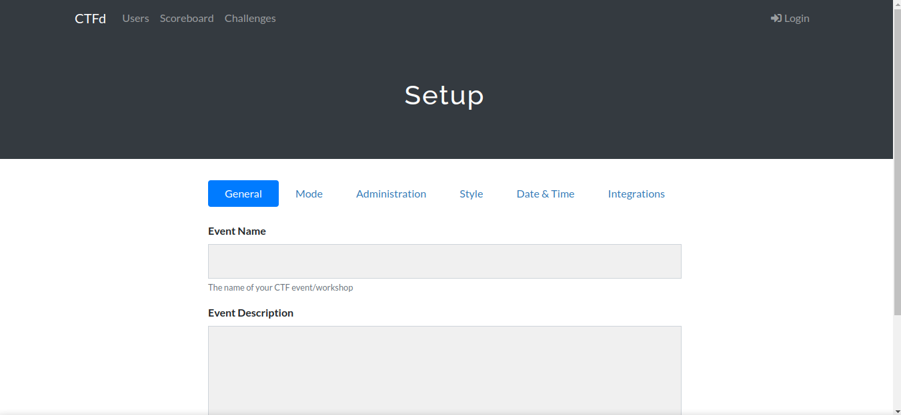

Pada postingan blog pertama ini saya akan membagikan bagaimana cara menjalankan CTFd dengan menggunakan Docker Compose.

## Apa itu CTFd
CTFd adalah kerangka kerja Capture The Flag yang berfokus pada kemudahan penggunaan dan kemampuan penyesuaian. CTFd memiliki fitur yang cukup lengkap untuk menjalankan acara lomba  Capture The Flag. CTFd ini mudah digunakan dan tersedia juga berbagai macam plugin dan tema, sehingga sangat mudah untuk di kustomisasi CTFd dibuat dalam bentuk aplikasi Web. Berikut ini tampilan dari CTFd.


## Fitur CTFd
* Buat tantangan, kategori, petunjuk, dan tanda Anda sendiri dari Antarmuka Admin
* Tantangan Penilaian Dinamis
* Membuat tantangan kustom Anda sendiri
* Unggah file ke server atau backend yang kompatibel dengan Amazon S3
* Perlindungan bruteforce otomatis
* Kompetisi berbasis individu dan tim
* Sembunyikan Skor dari publik
* Bekukan Skor pada waktu tertentu
* Dukungan email SMTP + Mailgun
* Dukungan konfirmasi email
* Dukungan lupa kata sandi
* Mengimpor dan Mengekspor data CTF untuk arsip
* Dan lain lain

Lebih lengkapnya anda bisa melihat di dokumentasi resmi CTFd pada tautan [berikut](https://github.com/CTFd/CTFd).

## Persiapan
Siapkan beberapa bagian berikut sebelum menjalankan CTFd menggunakan Docker Compose
* Sediakan 1 VPS dengan Sistem Operasi Ubuntu/Debian
* Pastikan Docker Engine dan Docker Compose telah terinstall di VPS

## Langkah - langkah

1. Masuk ke konsole VPS yang telah disiapkan.

2. Lakukan installasi Docker menggunakan tautan dibawah ini.  
[Instalasi Docker Engine dan Compose](https://docs.docker.com/engine/install/)
3. Cek apakah docker dan docker compose telah terinstall  

4. Lakukan instalasi git dengan perintah berikut  
```bash
apt install git -y 
```
5. Lakukan cloning repository dari CTFD dengan perintah berikut
```bash
git clone https://github.com/CTFd/CTFd.git
```


6. Masuk ke direktori CTFD  
```bash
cd CTFd/ 
```
7. Generate secret key dengan perintah berikut
```bash
head -c 64 /dev/urandom > .ctfd_secret_key
```
8. Jalankan docker compose  
```bash
docker compose up
```
9. CTFd dapat diakses pada http://IP-Server:8000. Berikut ini tampilan halaman setup dari CTFd.

10. Kerangka Kerja CTFd siap untuk dikonfigurasi dan digunakan.

## Penutup
Sekian sedikit materi yang dapat saya bagikan pada postingan ini, Apabila ada kesalahan saya mohon maaf, dan apabila ingin bertanya pada kolom komentar silahkan tulis di kolom komentar. Terima kasih.
 
## Sumber
* Dokumentasi Resmi CTFD : [https://docs.ctfd.io/docs/deployment/installation](https://docs.ctfd.io/docs/deployment/installation)
