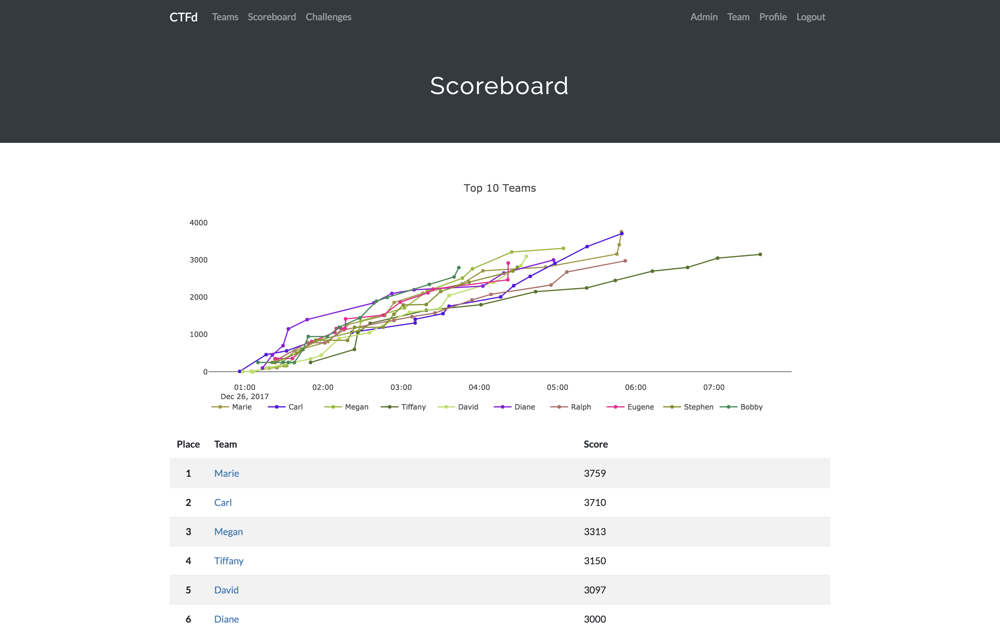

Pada postingan blog pertama ini saya akan membagikan bagaimana cara menjalankan CTFd dengan menggunakan Docker Compose.

## Apa itu CTFd
CTFd adalah kerangka kerja Capture The Flag yang berfokus pada kemudahan penggunaan dan kemampuan penyesuaian. CTFd memiliki fitur yang cukup lengkap untuk menjalankan acara lomba  Capture The Flag. CTFd ini mudah digunakan dan tersedia juga berbagai macam plugin dan tema, sehingga sangat mudah untuk di kustomisasi CTFd dibuat dalam bentuk aplikasi Web. Berikut ini tampilan dari CTFd.



## Fitur CTFd
* Buat tantangan, kategori, petunjuk, dan tanda Anda sendiri dari Antarmuka Admin
* Tantangan Penilaian Dinamis
* Membuat tantangan kustom Anda sendiri
* Unggah file ke server atau backend yang kompatibel dengan Amazon S3
* Perlindungan bruteforce otomatis
* Kompetisi berbasis individu dan tim
* Sembunyikan Skor dari publik
* Bekukan Skor pada waktu tertentu
* Dukungan email SMTP + Mailgun
* Dukungan konfirmasi email
* Dukungan lupa kata sandi
* Mengimpor dan Mengekspor data CTF untuk arsip
* Dan lain lain

Lebih lengkapnya anda bisa melihat di dokumentasi resmi CTFd pada tautan [berikut](https://github.com/CTFd/CTFd).

## Persiapan
Siapkan beberapa bagian berikut sebelum menjalankan CTFd menggunakan Docker Compose
* Sediakan 1 VPS dengan Sistem Operasi Ubuntu/Debian
* Pastikan Docker Engine dan Docker Compose telah terinstall di VPS

## Langkah - langkah

1. Masuk ke konsole VPS yang telah disiapkan.

2. Lakukan installasi Docker menggunakan tautan dibawah ini.  
[Instalasi Docker Engine dan Compose](https://docs.docker.com/engine/install/)
3. Cek apakah docker dan docker compose telah terinstall  

4. Lakukan instalasi git dengan perintah berikut  
```bash
apt install git -y 
```
5. Lakukan cloning repository dari CTFD dengan perintah berikut
```bash
git clone https://github.com/CTFd/CTFd.git
```


6. Masuk ke direktori CTFD  
```bash
cd CTFd/ 
```
7. Generate secret key dengan perintah berikut
```bash
head -c 64 /dev/urandom > .ctfd_secret_key
```
8. Jalankan docker compose  
```bash
docker compose up
```
9. CTFd dapat diakses pada http://IP-Server:8000. Berikut ini tampilan halaman setup dari CTFd.

10. Kerangka Kerja CTFd siap untuk dikonfigurasi dan digunakan.

## Menjalankan CTFd pada Port 80
Secara bawaan konfigurasi CTFd menggunakan Docker Compose berjalan pada Port 8000, untuk mengubah menjadi port 80 jalankan langkah - langkah berikut.

1. Pertama - tama, ubah terlebih dahulu konfigurasi CTFd pada docker-compose.yml. Buka docker-compose.yml menggunakan perintah nano.  
```bash 
nano docker-compose.yaml
```
2. Hapus konfigurasi berikut pada service CTFd.  
```yaml
ports:
  - "8000:8000"
```
3. Sehingga berkas docker-compose.yaml menjadi seperti dibawah ini.
```yaml
version: '2'

services:
  ctfd:
    build: .
    user: root
    restart: always
    environment:
      - UPLOAD_FOLDER=/var/uploads
      - DATABASE_URL=mysql+pymysql://ctfd:ctfd@db/ctfd
      - REDIS_URL=redis://cache:6379
      - WORKERS=1
      - LOG_FOLDER=/var/log/CTFd
      - ACCESS_LOG=-
      - ERROR_LOG=-
      - REVERSE_PROXY=true
    volumes:
      - .data/CTFd/logs:/var/log/CTFd
      - .data/CTFd/uploads:/var/uploads
      - .:/opt/CTFd:ro
    depends_on:
      - db
    networks:
        default:
        internal:

  nginx:
    image: nginx:stable
    restart: always
    volumes:
      - ./conf/nginx/http.conf:/etc/nginx/nginx.conf
    ports:
      - 80:80
    depends_on:
      - ctfd

  db:
    image: mariadb:10.4.12
    restart: always
    environment:
      - MYSQL_ROOT_PASSWORD=ctfd
      - MYSQL_USER=ctfd
      - MYSQL_PASSWORD=ctfd
      - MYSQL_DATABASE=ctfd
    volumes:
      - .data/mysql:/var/lib/mysql
    networks:
        internal:
    # This command is required to set important mariadb defaults
    command: [mysqld, --character-set-server=utf8mb4, --collation-server=utf8mb4_unicode_ci, --wait_timeout=28800, --log-warnings=0]

  cache:
    image: redis:4
    restart: always
    volumes:
    - .data/redis:/data
    networks:
        internal:

networks:
    default:
    internal:
        internal: true
```
4. Konfigurasi nginx perlu dilakukan perubahan karena pada repository url reverse proxynya masih belum sesuai, sehingga CTFd tidak dapat berjalan pada port 80. Buka berkas konfigurasi nginx menggunakan perintah nano.  
```bash 
nano conf/nginx/http.conf
```
5. Sesuaikan konfigurasi menjadi seperti dibawah ini.
```bash
worker_processes 4;

events {

  worker_connections 1024;
}

http {

  # Configuration containing list of application servers
  upstream app_servers {

    server ctfd:8000;
  }

  server {

    listen 80;

    client_max_body_size 4G;

    # Handle Server Sent Events for Notifications
    location /events {

      proxy_pass http://ctfd:8000;
      proxy_set_header Connection '';
      proxy_http_version 1.1;
      chunked_transfer_encoding off;
      proxy_buffering off;
      proxy_cache off;
      proxy_redirect off;
      proxy_set_header Host $host;
      proxy_set_header X-Real-IP $remote_addr;
      proxy_set_header X-Forwarded-For $proxy_add_x_forwarded_for;
      proxy_set_header X-Forwarded-Host $server_name;
    }

    # Proxy connections to the application servers
    location / {

      proxy_pass http://ctfd:8000;
      proxy_redirect off;
      proxy_set_header Host $host;
      proxy_set_header X-Real-IP $remote_addr;
      proxy_set_header X-Forwarded-For $proxy_add_x_forwarded_for;
      proxy_set_header X-Forwarded-Host $server_name;
    }
  }
}
```
6. Perubahan ada pada bagian `proxy_pass http://ctfd:8000` yang mana pada konfigurasi sebelumnya
`proxy_pass http://app_servers` .
7. Jalankan Docker Compose  
```bash 
docker compose up
```
8. CTFd dapat diakses pada http://IP-Server. Berikut ini tampilan halaman setup dari CTFd.

9. Kerangka Kerja CTFd sudah berjalan pada port 80.

## Penutup
Sekian sedikit materi yang dapat saya bagikan pada postingan ini, Apabila ada kesalahan saya mohon maaf, dan apabila ingin bertanya pada kolom komentar silahkan tulis di kolom komentar. Terima kasih.
 
## Sumber
* Dokumentasi Resmi CTFD : [https://docs.ctfd.io/docs/deployment/installation](https://docs.ctfd.io/docs/deployment/installation)
